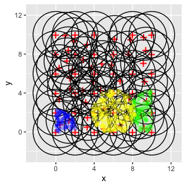
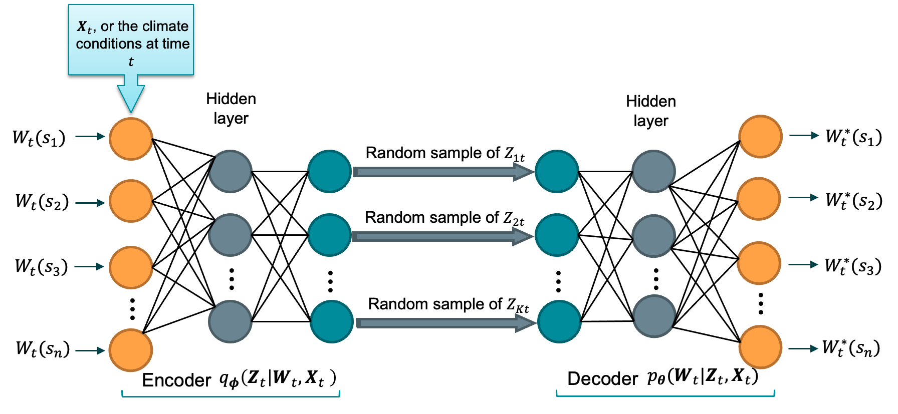

# XVAE

Emulating complex climate models via integrating variational autoencoder
and spatial extremes

> Department of Statistics, University of Missouri

### Max-infinitely divisible processes

Our model is based on the max-infinitely divisible process proposed by
Bopp et al. (2021)[[1]](#1) and allows for both short-range asymptotic
independence and dependence along with long-range asymptotic
independence, which can be specified as follows:

<p align="center">


</p>

where $X_t(s)$ is a spatio-temporal output from a simulator (e.g.,
high-resolution climate model), $\epsilon_t(s)$ is a white noise process
with independent $1/\alpha$-Fréchet marginal distribution, and $Y_t(s)$
is described by a low-rank representation:

<p align="center">


</p>

Here, we use compactly-supported Wendland basis functions
$\omega_k(s, r_k)$, $k=1,\ldots,K$, which are centered at $K$
pre-specified knots. The latent variables are lighter-tailed,
exponentially tilted, positive-stable variables:

<p align="center">


</p>

in which $\alpha\in (0,1)$ is the concentration parameter, and larger
values of the tail index $\theta_k\geq 0$ induce lighter-tailed
distributions of $Z_{kt}$.

### User instructions

The users can follow the data analysis shown in our manuscript
[link](https://arxiv.org/abs/2307.08079) to learn the implementation of
the XVAE. Right now, the XVAE is implemented in R with different
scripts. We wish to translate everything into python in the near future
and deliver a more user-friendly package. For the time being, the users
can simply run through the following scripts: - Initialization.R -
XVAE_stochastic_gradient_descent.R - XVAE_results_summary.R

Next, we demonstrate how to train an XVAE using the dataset simulated from Model III in the Simulation Study of Zhang et al. [[2]](#2). The steps to run an XVAE can be generally applied to any spatial input.

#### 1. Derive the data-driven knots
First, we need to make sure the file `utils.R` and  is under your working directory so all the utility functions can be loaded:
``` ruby
source("utils.R")
load("example_X.RData")
```

Assume the input data `X` is appropriately marginally transformed that has rows representing different locations and columns representing different times, and `stations` stores the 2-D coordinates of each location.

Then, we apply Algorithm 1 in the Supplementary Material of Zhang et al. [[2]](#2) to select data-driven knots based on high values (e.g., `thresh_p=0.95`) in the input data matrix and also determine the radius for the Wendland basis functions:
``` ruby
knots <- data_driven_knots(X, stations, 0.95, echo=TRUE)
r <- calc_radius(knots, stations)
```

With the knot locations, we can calculate the Wendland basis function values and row-standardize so they sum up to 1 for each location
``` ruby
W <- wendland(eucD,r=r)
W <- sweep(W, 1, rowSums(W), FUN="/")
dim(W)
```
Here, the dimensions of `W` should be $n_s\times k$, and we can do some bookkeeping of the dimensions:
``` ruby
k = nrow(knots)
n.s <- nrow(stations)
n.t <- ncol(X)
stations <- data.frame(stations)
knots <- data.frame(knots)
```

_(Optional) Visualize knots and the coverage of Wendland basis functions_
``` ruby
visualize_knots(knots, stations, r, W)
```



#### 2. Initial values for latent variables
In this section, we first find the initial values for the latent expPS variables via solving a linear system using QR decomposition:
``` ruby
W_alpha <- W^(1/alpha)
Z_approx <- array(NA, dim=c(k, n.t))
for (iter in 1:n.t){
  if(iter %% 10 == 0 ) cat('Finding good initial Z_t for time', iter, '\n')
  Z_approx[,iter] <- relu(qr.solve(a=W_alpha, b=X[,iter]))
}

Y_star <- (W_alpha)%*%(Z_approx)
Y_approx <- Y_star - relu(Y_star-X) 
```


Now we initialize the weights and biases for the encoder in the VAE and define them as `torch` tensor:
``` ruby
## -------------------- Initial values for the weights --------------------
X_tensor <- torch_tensor(X,dtype=torch_float())
W_tensor <- torch_tensor(W,dtype=torch_float())
tmp <- qr.solve(a=t(X), b=t(Z_approx))
w_1 <- t(tmp)
w_1 <- torch_tensor(w_1,dtype=torch_float(),requires_grad = TRUE)
b_1 <- matrix(rep(0,k), ncol=1) 
b_1 <- torch_tensor(b_1,dtype=torch_float(),requires_grad = TRUE)

w_2 <- diag(k)
w_2 <- torch_tensor(w_2,dtype=torch_float(),requires_grad = TRUE)
b_2 <- matrix(rep(0.00001,k), ncol=1)
b_2 <- torch_tensor(b_2,dtype=torch_float(),requires_grad = TRUE)

w_4 <- diag(k)
w_4 <- torch_tensor(w_4,dtype=torch_float(),requires_grad = TRUE)
b_4 <- matrix(rep(0,k), ncol=1) 
b_4 <- torch_tensor(b_4,dtype=torch_float(),requires_grad = TRUE)

w_3 <- 0*diag(k)
w_3 <- torch_tensor(w_3,dtype=torch_float(),requires_grad = TRUE)
b_3 <- matrix(rep(-15,k), ncol=1)
b_3 <- torch_tensor(b_3,dtype=torch_float(),requires_grad = TRUE)


h <- w_1$mm(X_tensor)$add(b_1)$relu()
h_1 <- w_2$mm(h)$add(b_2)$relu()
sigma_sq_vec <- w_3$mm(h_1)$add(b_3)$exp()
mu <- w_4$mm(h_1)$add(b_4)$relu()

## -------------------- Re-parameterization trick --------------------
Epsilon <- matrix(abs(rnorm(k*n.t))+0.1, nrow=k)
Epsilon <- torch_tensor(Epsilon,dtype=torch_float())
v_t <- mu + sqrt(sigma_sq_vec)*Epsilon
b_8 <- as_array((W_tensor^(1/alpha)))%*%as_array(v_t)-X
b_8 <- array(-relu(b_8), dim=dim(b_8))
b_8 <- torch_tensor(b_8,dtype=torch_float(), requires_grad = TRUE)


y_approx <-  (W_tensor^(1/alpha))$mm(v_t) + b_8
```


Now moving on to initialize the decoder:
``` ruby
## -------------------- w_prime and b_prime for theta --------------------
w_1_prime <- as_array(w_1) #matrix(rnorm(k*n.s,0,0.001), nrow=k)
w_1_prime <- torch_tensor(w_1_prime,dtype=torch_float(),requires_grad = TRUE)
w_2_prime <- matrix(diag(k), nrow=k)
w_2_prime <- torch_tensor(w_2_prime,dtype=torch_float(),requires_grad = TRUE)
w_3_prime <- matrix(rep(0,k*k), nrow=k)
w_3_prime <- torch_tensor(w_3_prime,dtype=torch_float(),requires_grad = TRUE)
w_4_prime <- matrix(diag(k), nrow=k)
w_4_prime <- torch_tensor(w_4_prime,dtype=torch_float(),requires_grad = TRUE)
b_1_prime <- matrix(rep(0,k), ncol=1) #matrix(rnorm(k), ncol=1)
b_1_prime <- torch_tensor(b_1_prime,dtype=torch_float(),requires_grad = TRUE)
b_2_prime <- matrix(rep(0.05,k), ncol=1)
b_2_prime <- torch_tensor(b_2_prime,dtype=torch_float(),requires_grad = TRUE)
b_3_prime <- matrix(rep(-10,k), ncol=1)
b_3_prime <- torch_tensor(b_3_prime,dtype=torch_float(),requires_grad = TRUE)
b_4_prime <- matrix(rep(0,k), ncol=1)
b_4_prime <- torch_tensor(b_4_prime,dtype=torch_float(),requires_grad = TRUE)

w_5 <- diag(k) #matrix(rnorm(k*k,0,0.001), nrow=k)
w_5 <- torch_tensor(w_5,dtype=torch_float(),requires_grad = TRUE)
w_6 <- diag(k) #matrix(rnorm(k*k,0,0.001), nrow=k)
w_6 <- torch_tensor(w_6,dtype=torch_float(),requires_grad = TRUE)
w_7 <- diag(k) #matrix(rnorm(k*k,0,0.0001), nrow=k)
w_7 <- torch_tensor(w_7,dtype=torch_float(),requires_grad = TRUE)
b_5 <- matrix(rep(1e-6,k), ncol=1) #matrix(rnorm(k), ncol=1)
b_5 <- torch_tensor(b_5,dtype=torch_float(),requires_grad = TRUE)
b_6 <- matrix(rep(1e-6,k), ncol=1) #matrix(rnorm(k), ncol=1)
b_6 <- torch_tensor(b_6,dtype=torch_float(),requires_grad = TRUE)
b_7 <- matrix(rep(1e-6,k), ncol=1) #matrix(rnorm(k,0,0.0001), ncol=1)
b_7 <- torch_tensor(b_7,dtype=torch_float(),requires_grad = TRUE)

w_1_velocity <- torch_zeros(w_1$size())
w_2_velocity <- torch_zeros(w_2$size())
w_3_velocity <- torch_zeros(w_3$size())
w_4_velocity <- torch_zeros(w_4$size())
b_1_velocity <- torch_zeros(b_1$size())
b_2_velocity <- torch_zeros(b_2$size())
b_3_velocity <- torch_zeros(b_3$size())
b_4_velocity <- torch_zeros(b_4$size())
w_1_prime_velocity <- torch_zeros(w_1_prime$size())
w_2_prime_velocity <- torch_zeros(w_2_prime$size())
w_3_prime_velocity <- torch_zeros(w_3_prime$size())
w_4_prime_velocity <- torch_zeros(w_4_prime$size())
b_1_prime_velocity <- torch_zeros(b_1_prime$size())
b_2_prime_velocity <- torch_zeros(b_2_prime$size())
b_3_prime_velocity <- torch_zeros(b_3_prime$size())
b_4_prime_velocity <- torch_zeros(b_4_prime$size())

w_5_velocity <- torch_zeros(w_5$size())
w_6_velocity <- torch_zeros(w_6$size())
w_7_velocity <- torch_zeros(w_7$size())
b_5_velocity <- torch_zeros(b_5$size())
b_6_velocity <- torch_zeros(b_6$size())
b_7_velocity <- torch_zeros(b_7$size())

b_8_velocity <- torch_zeros(b_8$size())

Epsilon_prime <- t(mvtnorm::rmvnorm(n.t, mean=rep(0, k), sigma = diag(rep(1, k))))
Epsilon_prime <- torch_tensor(Epsilon_prime,dtype=torch_float())
```

#### 3. Training the VAE
Now we set up the learning rate, and other network parameters
``` ruby
learning_rate <- -1e-13
alpha_v <- 0.9
lrelu <- nn_leaky_relu(-0.01)
```

``` ruby
nepoch = 80000
n <- 1e3
# only depends on alpha; we are not updating alpha for now.
vec <- Zolo_A(pi*seq(1/2,n-1/2,1)/n, alpha)
Zolo_vec <- torch_tensor(matrix(vec, nrow=1,ncol=n), dtype=torch_float(), requires_grad = FALSE) 
Zolo_vec_double <- torch_tensor(Zolo_vec, dtype = torch_float64(), requires_grad = FALSE)
const <- 1/(1-alpha); const1 <- 1/(1-alpha)-1; const3 <- log(const1)
W_alpha_tensor <- W_tensor$pow(1/alpha)
old_loss <- -Inf
```

Start training:
``` ruby
for (t in 1:nepoch) {
  if(t==1000) { learning_rate <- -5e-13; alpha_v <- 0.9}
  if(t==5000) { learning_rate <- -1e-12; alpha_v <- 0.8}
  if(t==80000) { learning_rate <- -2e-12; alpha_v <- 0.7}
  if(t==90000) { learning_rate <- -1e-11; alpha_v <- 0.7}
  if(t==100000) { learning_rate <- -2e-11; alpha_v <- 0.5}
  if(t==110000) { learning_rate <- -5e-10; alpha_v <- 0.4}
  if(t==120000) { learning_rate <- -1e-9; alpha_v <- 0.4}
  if(t==140000) { learning_rate <- -1e-8; alpha_v <- 0.4}
  if(t==300000) { learning_rate <- -1e-7; alpha_v <- 0.4}
  
  ### -------- Forward pass --------
  Epsilon <- t(0.1+abs(mvtnorm::rmvnorm(n.t, mean=rep(0, k), sigma = diag(rep(1, k)))))
  Epsilon_prime <- t(mvtnorm::rmvnorm(n.t, mean=rep(0, k), sigma = diag(rep(1, k))))
  
  Epsilon <- torch_tensor(Epsilon,dtype=torch_float())
  Epsilon_prime <- torch_tensor(Epsilon_prime,dtype=torch_float())
  
  
  ### -------- Encoder for v_t --------
  h <- w_1$mm(X_tensor)$add(b_1)$relu()
  h_1 <- w_2$mm(h)$add(b_2)$relu()
  sigma_sq_vec <- w_3$mm(h_1)$add(b_3)$exp()
  mu <- w_4$mm(h_1)$add(b_4)$relu()
  
  ### -------- Encoder for v_t_prime --------
  h_prime <- w_1_prime$mm(X_tensor)$add(b_1_prime)$relu()
  h_1_prime <- w_2_prime$mm(h_prime)$add(b_2_prime)$relu()
  
  ### -------- Activation via Laplace transformation --------
  h_1_prime_laplace <- h_1_prime$multiply(-0.2)$exp()$mean(dim=2)
  h_1_prime_t <- h_1_prime_laplace$log()$multiply(-1)
  h_1_prime_to_theta <- (0.2-h_1_prime_t$pow(2))$pow(2)$divide(4*h_1_prime_t$pow(2))$view(c(k,1))
  theta_propagate <- h_1_prime_to_theta$expand(c(k,n.t))
  
  sigma_sq_vec_prime <- w_3_prime$mm(theta_propagate)$add(b_3_prime)$exp() #w_3_prime$mm(h_1_prime)$add(b_3_prime)$exp()
  mu_prime <- w_4_prime$mm(theta_propagate)$add(b_4_prime) #w_4_prime$mm(h_1_prime)$add(b_4_prime)
  
  ### -------- Re-parameterization trick --------
  v_t <- mu + sqrt(sigma_sq_vec)*Epsilon
  v_t_prime <- mu_prime + sqrt(sigma_sq_vec_prime)*Epsilon_prime
  
  
  ### -------- Decoder --------
  l <- w_5$mm(v_t_prime)$add(b_5)$relu()
  l_1 <- w_6$mm(l)$add(b_6)$relu()
  theta_t <- w_7$mm(l_1)$add(b_7)$relu()
  
  y_star <- lrelu(W_alpha_tensor$mm(v_t)$add(b_8))
  
  
  ### -------- ELBO -------- 
  ### Part 1
  standardized <- X_tensor$divide(y_star)$sub(m)
  leak <- as_array(sum(standardized<0))
  if(leak>0 & leak<=175) standardized$abs_()
  leak2 <- as_array(sum(standardized==0))
  if(leak2>0 & leak2<=120) standardized$add_(1e-07)
  part1 <- -2 * standardized$log()$sum() - y_star$log()$sum() - tau*standardized$pow(-1)$sum() # + n.s*n.t*log(tau)
  
  ### Part 2
  V_t <- v_t$view(c(k*n.t,1))
  Theta_t <- theta_t$view(c(k*n.t,1))
  part_log_v1  <- V_t$pow(-const)$mm(Zolo_vec) 
  part_log_v2  <- (-V_t$pow(-const1)$mm(Zolo_vec))$exp()
  part_log_v3 <- Theta_t$pow(alpha)-Theta_t$mul(V_t)
  part2 <- (part_log_v1$mul(part_log_v2)$mean(dim=2)$log()+part_log_v3$view(k*n.t)$add(const3))$sum()
  if(as_array(part2) == -Inf) {
    part2_tmp <- part_log_v1$log()[,1] + (-V_t$pow(-const1)$mm(Zolo_vec))[,1]
    part2 <- (part2_tmp+part_log_v3$view(k*n.t)$add(const3))$sum()
  }
  
  ### Part 3
  part3 = Epsilon$pow(2)$sum()/2 + Epsilon_prime$pow(2)$sum()/2 + sigma_sq_vec$log()$sum() + sigma_sq_vec_prime$log()$sum()
  res <- part1 + part2 + part3
  
  ### -------- compute loss -------- 
  loss <- (res/(n.s*n.t))
  if(!is.finite(loss$item())) break
  if (t %% 1 == 0)
    cat("Epoch: ", t, "   ELBO: ", loss$item(), "\n") # we want to maximize
  if (as.numeric(torch_isnan(loss))==1) break
  ### -------- Backpropagation --------
  # compute gradient of loss w.r.t. all tensors with requires_grad = TRUE
  loss$backward()
  # w_1$grad$argmax(dim=2)
  
  ### -------- Update weights -------- 
  
  # Wrap in with_no_grad() because this is a part we DON'T 
  # want to record for automatic gradient computation
  with_no_grad({
    old_loss <- loss$item()
    w_1_velocity <- alpha_v*w_1_velocity - learning_rate*w_1$grad
    w_1$add_(w_1_velocity)
    w_2_velocity <- alpha_v*w_2_velocity - learning_rate*w_2$grad
    w_2$add_(w_2_velocity)
    w_3_velocity <- alpha_v*w_3_velocity - learning_rate*w_3$grad
    w_3$add_(w_3_velocity)
    w_4_velocity <- alpha_v*w_4_velocity - learning_rate*w_4$grad
    w_4$add_(w_4_velocity)
    b_1_velocity <- alpha_v*b_1_velocity - learning_rate*b_1$grad
    b_1$add_(b_1_velocity)
    b_2_velocity <- alpha_v*b_2_velocity - learning_rate*b_2$grad
    b_2$add_(b_2_velocity)
    b_3_velocity <- alpha_v*b_3_velocity - learning_rate*b_3$grad
    b_3$add_(b_3_velocity)
    b_4_velocity <- alpha_v*b_4_velocity - learning_rate*b_4$grad
    b_4$add_(b_4_velocity)
    w_1_prime_velocity <- alpha_v*w_1_prime_velocity - learning_rate*w_1_prime$grad
    w_1_prime$add_(w_1_prime_velocity)
    w_2_prime_velocity <- alpha_v*w_2_prime_velocity - learning_rate*w_2_prime$grad
    w_2_prime$add_(w_2_prime_velocity)
    w_3_prime_velocity <- alpha_v*w_3_prime_velocity - learning_rate*w_3_prime$grad
    w_3_prime$add_(w_3_prime_velocity)
    w_4_prime_velocity <- alpha_v*w_4_prime_velocity - learning_rate*w_4_prime$grad
    w_4_prime$add_(w_4_prime_velocity)
    b_1_prime_velocity <- alpha_v*b_1_prime_velocity - learning_rate*b_1_prime$grad
    b_1_prime$add_(b_1_prime_velocity)
    b_2_prime_velocity <- alpha_v*b_2_prime_velocity - learning_rate*b_2_prime$grad
    b_2_prime$add_(b_2_prime_velocity)
    b_3_prime_velocity <- alpha_v*b_3_prime_velocity - learning_rate*b_3_prime$grad
    b_3_prime$add_(b_3_prime_velocity)
    b_4_prime_velocity <- alpha_v*b_4_prime_velocity - learning_rate*b_4_prime$grad
    b_4_prime$add_(b_4_prime_velocity)
    
    w_5_velocity <- alpha_v*w_5_velocity - learning_rate*w_5$grad
    w_5$add_(w_5_velocity)
    w_6_velocity <- alpha_v*w_6_velocity - learning_rate*w_6$grad
    w_6$add_(w_6_velocity)
    w_7_velocity <- alpha_v*w_7_velocity - learning_rate*w_7$grad
    w_7$add_(w_7_velocity)
    b_5_velocity <- alpha_v*b_5_velocity - learning_rate*b_5$grad
    b_5$add_(b_5_velocity)
    b_6_velocity <- alpha_v*b_6_velocity - learning_rate*b_6$grad
    b_6$add_(b_6_velocity)
    b_7_velocity <- alpha_v*b_7_velocity - learning_rate*b_7$grad
    b_7$add_(b_7_velocity)
    b_8_velocity <- alpha_v*b_8_velocity - learning_rate*b_8$grad
    b_8$add_(b_8_velocity)
    
    # Zero gradients after every pass, as they'd accumulate otherwise
    w_1$grad$zero_()
    w_2$grad$zero_()
    w_3$grad$zero_()
    w_4$grad$zero_()
    b_1$grad$zero_()
    b_2$grad$zero_()
    b_3$grad$zero_()
    b_4$grad$zero_()
    w_1_prime$grad$zero_()
    w_2_prime$grad$zero_()
    w_3_prime$grad$zero_()
    w_4_prime$grad$zero_()
    b_1_prime$grad$zero_()
    b_2_prime$grad$zero_()
    b_3_prime$grad$zero_()
    b_4_prime$grad$zero_()
    w_5$grad$zero_()
    w_6$grad$zero_()
    w_7$grad$zero_()
    b_5$grad$zero_()
    b_6$grad$zero_()
    b_7$grad$zero_()
    b_8$grad$zero_()
  })
}
```

### (Conditional) Variational autoencoder



## References

<a id="1">[1]</a> Gregory P Bopp, Benjamin A Shaby, and Raphaël Huser. A
hierarchical max-infinitely divisible spatial model for extreme
precipitation. *Journal of the American Statistical Association*,
116(533):93–106, 2021.

<a id="2">[2]</a> Zhang, Likun, Xiaoyu Ma, Christopher K. Wikle, and
Raphaël Huser. "Flexible and efficient spatial extremes emulation via
variational autoencoders." arXiv preprint arXiv:2307.08079 (2024).
