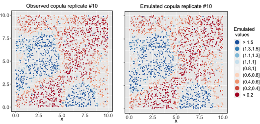
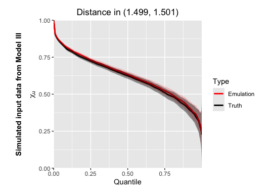
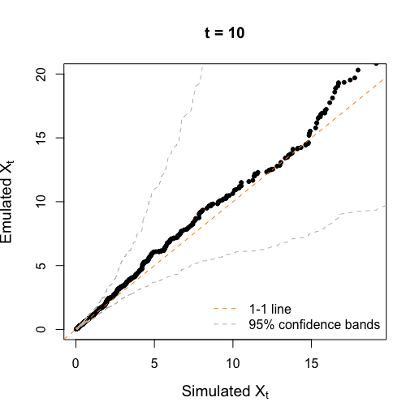
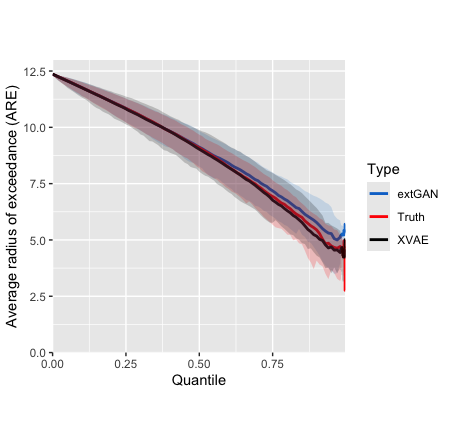

# XVAE Tutorial 

Emulating complex climate models via integrating variational autoencoder
and spatial extremes

> Department of Statistics, University of Missouri

## Introduction
This tutorial provides step-by-step instructions for implementing the XVAE model, designed to emulate 
high-resolution climate models by integrating spatial extreme value theory with a variational autoencoder (VAE). 
The methodology follows the max-infinitely divisible process proposed by Bopp et al. (2021)[[1]](#1) and is implemented using `R`. 
A Python package is planned for future development.

## Implementation Guide

### Requirements
1. **Dependencies**: Install `R` libraries including `torch`, `dplyr`, `VGAM`, `extRemes` and any required visualization libraries such as `ggplot`.
2. The users can follow the demonstration shown below to learn the implementation of
the XVAE. We wish to translate everything into python in the near future
and deliver a more user-friendly package. For the time being, the users
can simply download the following scripts: 
- XVAE_utils.R 
- XVAE_initialization.R
- XVAE_training_loop.R


## Step-by-Step Instructions

Next, we demonstrate how to train an XVAE using the dataset simulated from Model III in the Simulation Study of Zhang et al. [[2]](#2). The steps to run an XVAE can be generally applied to any spatial input.

### 1. Generate data-driven knots

First, we need to make sure the file `XVAE_utils.R` is under your working directory so all the utility functions can be loaded:
``` ruby
source("XVAE_utils.R")
load("./data/example_X.RData")
```

Assume the input data `X` is appropriately marginally transformed that has rows representing different locations and columns representing different times, and `stations` stores the 2-D coordinates of each location.

Then, we apply Algorithm 1 in the Supplementary Material of Zhang et al. [[2]](#2) to select data-driven knots based on high values (e.g., `thresh_p=0.95`) in the input data matrix and also determine the radius for the Wendland basis functions:
``` ruby
knots <- data_driven_knots(X, stations, 0.95, echo=TRUE)
r <- calc_radius(knots, stations)
```

Using the knot locations, we calculate the Wendland basis function values and row-standardize them so that they sum to 1 at each location:
``` ruby
eucD <- rdist(stations,as.matrix(knots))
W <- wendland(eucD,r=r)
W <- sweep(W, 1, rowSums(W), FUN="/")
dim(W)  # Verify dimensions: `n.s` × `k`
```
Here, the dimensions of `W` should be $n_s\times k$, and we can summarize the dimensional bookkeeping as follows:
``` ruby
k = nrow(knots)
n.s <- nrow(stations)
n.t <- ncol(X)
stations <- data.frame(stations)
knots <- data.frame(knots)
```

_(Optional) Visualize knots and the coverage of Wendland basis functions_
``` ruby
visualize_knots(knots, stations, r, W)
```


### 2. Initial values for latent variables

In this section, we initialize the latent expPS variables via solving a linear system using QR decomposition:
``` ruby
# Setting up the Fréchet white noise process
alpha = 0.5; tau <- 0.1; m <- 0.85
W_alpha <- W^(1/alpha)
Z_approx <- array(NA, dim=c(k, n.t))
for (iter in 1:n.t){
  if(iter %% 10 == 0 ) cat('Finding good initial Z_t for time', iter, '\n')
  Z_approx[,iter] <- relu(qr.solve(a=W_alpha, b=X[,iter]))
}

# Compute approximations
Y_star <- (W_alpha)%*%(Z_approx)
Y_approx <- Y_star - relu(Y_star-X) 
```

### 3. Define VAE Weights and Encoder-Decoder Initialization
Now we initialize the weights and biases for the encoder in the VAE and define them as `torch` tensor:
``` ruby
## -------------------- Initializing VAE --------------------
source("Initializing_XVAE.R")
```

### 4. Training the VAE
Next, we configure the learning rate, activation functions, and other network parameters. These parameters might _require tuning_ based on dataset complexity and model performance.
``` ruby
learning_rate <- -1e-15; alpha_v <- 0.9
lrelu <- nn_leaky_relu(-0.01)
nEpoch = 10000
```
### Training Loop

The main training process, where the VAE optimizes the ELBO (Evidence Lower Bound; see Algorithm 2 in Zhang et al. [[2]](#2)):
``` ruby
source("XVAE_training_loop.R")
```

### 5. Post-Processing and Results

Now with the trained XVAE weights and biases in the global environment, we emulate the spatial input using the folowing function:
``` ruby
output <- emulate_from_trained_XVAE()
```
Here, `output` is a list with 
- `emulations`: A matrix of simulated values for spatial inputs.
-  `theta_est`: A matrix of estimated parameters from the decoder.

#### 5.1 Visual comparison
Now we compare the scatter plot of the spatial input and the emulation:
``` ruby
chosen_time <- 10
range_t <- c(0, max(X[,chosen_time]))
q25 <- quantile(X[,chosen_time], 0.25)
q75 <- quantile(X[,chosen_time], 0.75)

pal <- RColorBrewer::brewer.pal(9,"RdBu")
plt3 <- spatial_map(stations, var=X[,chosen_time], pal = pal,
                    title = paste0('Observed copula replicate #', chosen_time), legend.name = "Observed\n values", 
                    brks.round = 1, tight.brks = TRUE, range=range_t, q25=q25, q75=q75, pt.size=1, raster=FALSE)
plt3

plt31 <- spatial_map(stations, var=output$emulations[,chosen_time], pal = pal,
                     title = paste0('Emulated copula replicate #', chosen_time), legend.name = "Emulated\n values", 
                     brks.round = 1, tight.brks = TRUE, range=range_t, q25=q25, q75=q75, pt.size=1, raster=FALSE)
plt31
```


#### 5.2 $\chi_d(u)$ comparison

Now we empirically estimate $\chi_d(u),\; u\in (0,1),$ for both the original spatial input and the emulated dataset at $d\approx 1.5$:
``` ruby
chi_plot(X,stations, output$emulations, distance=1.5, legend = TRUE, ylab = expression(atop(bold("Simulated input data from Model III"), chi[u])))
```


#### 5.3 Quantile-Quantile plots
QQ-plot implemented in the package `extRemes` to compare two data vectors (input & emulation) with 95 percent confidence bands based on the Kolmogorov-Smirnov statistic:
``` ruby
extRemes::qqplot(X[,chosen_time], output$emulations[,chosen_time], regress = FALSE,
                 xlab=expression(paste('Simulated ', X[t])),
                 ylab=expression(paste('Emulated ', X[t])), cex.lab = 1.2,
                  xlim=c(0,19), ylim=c(0,20), main=paste("t =", chosen_time))
```


#### 5.4 Areal Radius of Exceedance (ARE)
This is a novel metric proposed in Section 3.3 of Zhang et al. [[2]](#2). It has many theoretical guarantees, and is specially tailored to evaluate the skill of a spatial model in reproducing dependent extreme.

Specifically, for a fixed regular grid $\mathcal{G}$ with side length $\psi$, a reference location $\mathbf{s}_0$ and $u\in(0,1)$, the ARE is defined as
u, U_{0r}>u)}{\pi\sum_{r=1}^{n_r}\mathbb{I}(U_{0r}>u)}\right\}^{1/2}." />

We have that, almost surely,  

that is, ARE converges to the square root of the spatial average of the $\chi$-measure.

The previous simulated dataset is not on a regular grid. But XVAE can perform spatial prediction and allows us to examine ARE on a grid with a certain side length.

We can use the following function to compute and visualize ARE:
``` ruby
ARE_comparison(stations, U1=U_sim_grid, U2=U_xvae_grid, U3=U_gan_grid, names =c("Truth", "XVAE", "extGAN"))
```



## Max-infinitely divisible processes

Our model is based on the max-infinitely divisible process proposed by
Bopp et al. (2021)[[1]](#1) and allows for both short-range asymptotic
independence and dependence along with long-range asymptotic
independence, which can be specified as follows:

<p align="center">


</p>

where 
- $X_t(s)$ is a spatio-temporal output from a simulator (e.g.,
high-resolution climate model), 
- $\epsilon_t(s)$ is a white noise process
with independent $1/\alpha$-Fréchet marginal distribution, 
- $Y_t(s)$ is described by a low-rank representation:

<p align="center">


</p>

with:
- $\omega_k(s, r_k)$ compactly-supported Wendland basis functions
, $k=1,\ldots,K$, which are centered at $K$
pre-specified knots. 
- $Z_{kt}\sim \text{expPS}(\alpha,\theta_k)$: Exponentially tilted, positive-stable variables,  governed by $\alpha\in (0,1)$ and a tail index 
$\theta_k\geq 0$.

## (Conditional) Variational autoencoder


## References

<a id="1">[1]</a> Gregory P Bopp, Benjamin A Shaby, and Raphaël Huser. A
hierarchical max-infinitely divisible spatial model for extreme
precipitation. *Journal of the American Statistical Association*,
116(533):93–106, 2021.

<a id="2">[2]</a> Zhang, Likun, Xiaoyu Ma, Christopher K. Wikle, and
Raphaël Huser. "Flexible and efficient spatial extremes emulation via
variational autoencoders." arXiv preprint arXiv:2307.08079 (2024).
